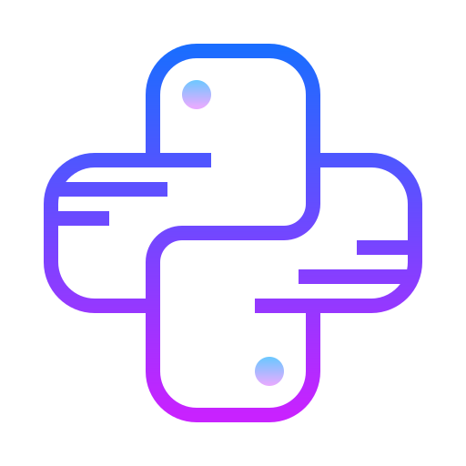

### Hi there, I'm  **Waqas Ahmed** 👋x
Alt-H1
__strong__
**bold**
## Developer, Partitioner & CS Student.

- 🔭 I'm currently studying and working on:  
    **(a)** Solve The Traffic Jam Problems in Big Cities **-**  Data Science Project.    
    **(b)** Heart attack prediction base on daily to daily routine  **-** Mobile App.  
    **(c)** Automation `Office`,`HOME`, and `Normal Day to Day Life` Tasks  **-** Python 
- 🥅 2020 Goals: DA,ML,DS,Front-End Developer.
- ⚡ Fun fact: I love to read,listen and research on specific topic.

### Connect With Me:

[][website]
[][youtube]
[][twitter]
[][linkedin]
[][instagram]

 

[website]: https://iswaqasahmed.surge.sh
[twitter]: https://twitter.com/AmWaqasAhmed
[youtube]: https://youtube.com/
[instagram]: https://www.instagram.com/amwaqasahmed/
[linkedin]: https://www.linkedin.com/in/waqas-ahmed-1a8b24162/
